# Tor PoW effort simulations

The simulations are relevant to the following version of the TOR PoW proposal:
https://github.com/tevador/torspec/blob/2424e7d16772a1b13d1f9288c5b7fd0656363836/proposals/ideas/xxx-pow-over-intro-v1

Reader should be familiar with the proposal.

The purpose of this simulation is to evaluate different methods of calculating the suggested effort for TOR clients connecting to a PoW-protected service. The simulation focuses on bottom-half attacks only.

Simulation source code: [effort_sim.py](effort_sim.py)

## Strategies

### Client

The simulation assumes that `CLIENT_COUNT` legitimate clients attempt to connect to the service every second. Clients submit PoW with an effort equal to the suggested value in the service descriptor. If the client's request is not served in `CLIENT_TIMEOUT` seconds, the client will double their effort and retry the connection. The performance of each client's machine is `CLIENT_PERF` solutions per second.

### Service

The simulation assumes that a maximum of `SVC_BOTTOM_CAPACITY` introduction requests can be handled by the service each second. The introduction queue has a maximum capacity of `QUEUE_CAPACITY = CLIENT_TIMEOUT * SVC_BOTTOM_CAPACITY` requests. Requests beyond the capacity of the queue are trimmed every second. Timed-out requests are also removed from the queue every second and are not served. The minimum non-zero effort is `MIN_EFFORT`.

The service will update the suggested effort every `HS_UPDATE_PERIOD` seconds.

The simulation assumes that at most `SVC_TOP_CAPACITY` requests can be added to the queue every second. Since the focus of this simulation are only bottom-half attacks, it is assumed that client requests can always enter the queue.

### Attacker

The attacker has `ATTACKER_MACHINES` machines with each machine capable of generating `CLIENT_PERF` solutions per second. The attacker has two possible strategies:

#### Sustained attack

The attacker submits as many requests as possible every second with an effort equal to the suggested effort plus one.

#### Precomputed attack

The attacker precomputes PoW for 115 minutes and then submits all precomputed requests in the last 5 minutes. The effort is selected so that `SVC_TOP_CAPACITY` requests are submitted per second during the last 5 minutes.

## Parameters

|parameter              |value|comment|
|-----------------------|-----|-------|
|`CLIENT_COUNT`         |20   |72000 clients per hour
|`CLIENT_TIMEOUT`       |30   |
|`CLIENT_PERF`          |1000 |approx. quad core CPU
|`SVC_BOTTOM_CAPACITY`  |180  |chapter 6.2.2 of the proposal
|`SVC_TOP_CAPACITY`     |3220 |chapter 6.1 with PoW verification of 0.05 ms
|`QUEUE_CAPACITY`       |5400 |`CLIENT_TIMEOUT * SVC_BOTTOM_CAPACITY`
|`MIN_EFFORT`           |1000-5000| see below
|`HS_UPDATE_PERIOD`     |300  |
|`ATTACKER_MACHINES`    |500 or 100000|"small botnet" vs "large botnet"

The attack was simulated to take place from `t = 150` until `t = 7350` (gray rectangle in charts below). Total duration of the attack is 2 hours.

## Simulation output

Every second, the simulation outputs:

* the current suggested effort
* the number of requests in the queue
* the number of legitimate clients that have successfully connected
* the average time to connect (TTC) for clients that have connected

The main goal of the protocol is to minimize TTC for legitimate clients.

## Results

### Algorithm v1

This is the algorithm described in the proposal draft.

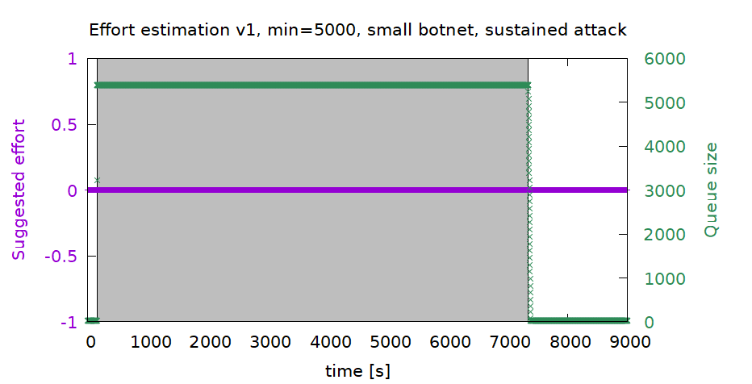


With the proposed effort estimation algorithm, the suggested effort stays at 0 for the whole duration of the attack. This is because the median effort of trimmed requests is 0 (the attacker blindly follows the suggested effort) and there is always sufficient capacity to serve reconnecting clients with nonzero effort.

As a result, clients suffer a relatively high TTC of 35 seconds. This consists of the 30 second timeout for the first unsuccessful request and 5 seconds to calculate the PoW for the second attempt. The service is however still available during the attack.

### Algorithm v2

We can try to improve the suggested effort by taking the *maximum* effort of trimmed requests and applying the following function to it:

```python
def increase_effort(effort):
    if effort < MIN_EFFORT:
        return MIN_EFFORT
    return 2 * effort
```

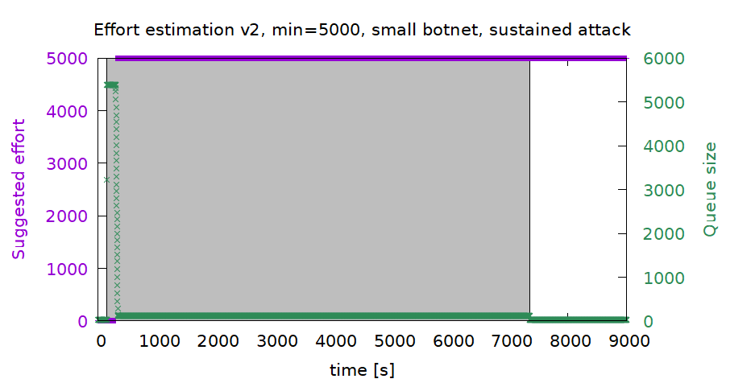

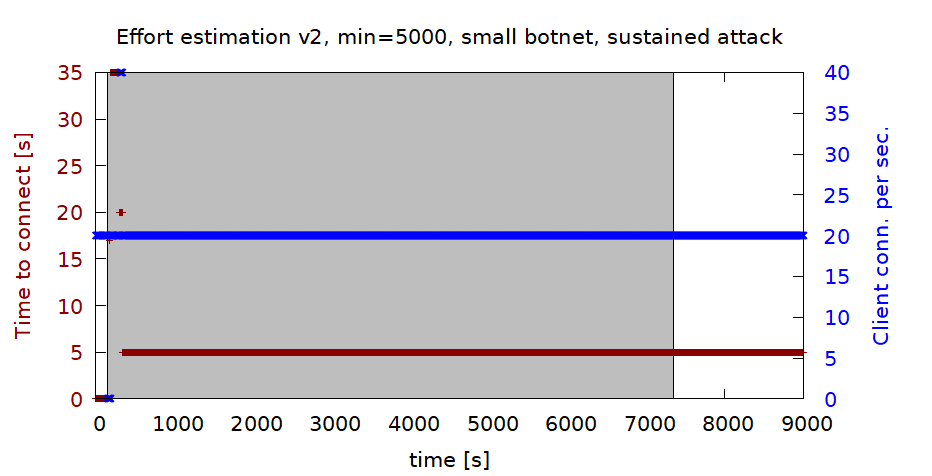

This function provides much better results. TTC spikes shortly to 35 seconds, but drops down to just 5 seconds after the suggested effort is updated at `t = 300`. However, the suggested effort fails to decrease after the end of the attack. This is because both the clients and the attacker follow the suggested effort in our scenario, so there are no low-effort handled requests.

The failure to adjust the suggested effort after the attack is even more visible with the "large botnet" attack:

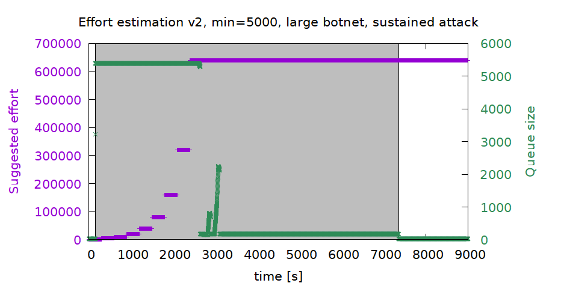

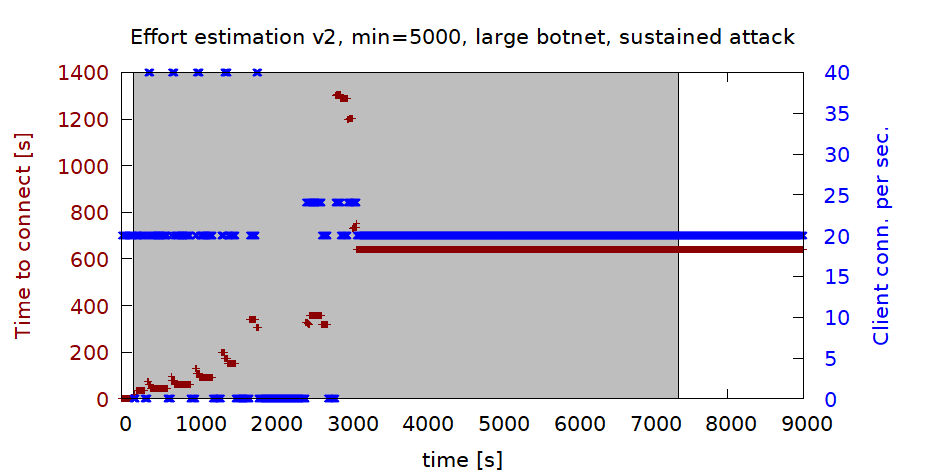

There are two main problems here:

* the effort adjustment is too slow, taking over 30 minutes to reach equilibrium, which causes TTC to spike to over 20 minutes
* the effort doesn't adjust downward when the attack ends

### Algorithm v3

A much better strategy appears to be to try to estimate the total computing power of all clients trying to reach the service:

```python
def recommend_effort3():
    effort = sum(trimmed_list)
    effort += sum(x.effort for x in handled)
    effort += sum(x.effort for x in queue)
    effort /= SVC_BOTTOM_CAPACITY * HS_UPDATE_PERIOD
    if effort < MIN_EFFORT:
        effort = MIN_EFFORT
    return effort
```
This function sums the effort of all valid requests it has received during the previous `HS_UPDATE_PERIOD` seconds (this includes trimmed requests, handled requests and queued requests). The result is divided by the maximum number of requests that could have been handled during that time.

This algorithm handles the large botnet attack much better, with TTC staying at around 10 minutes for the duration of the attack and adjusting downward quickly after the attack has ceased:

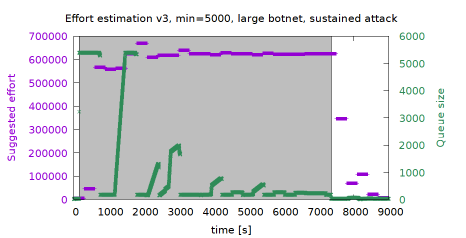

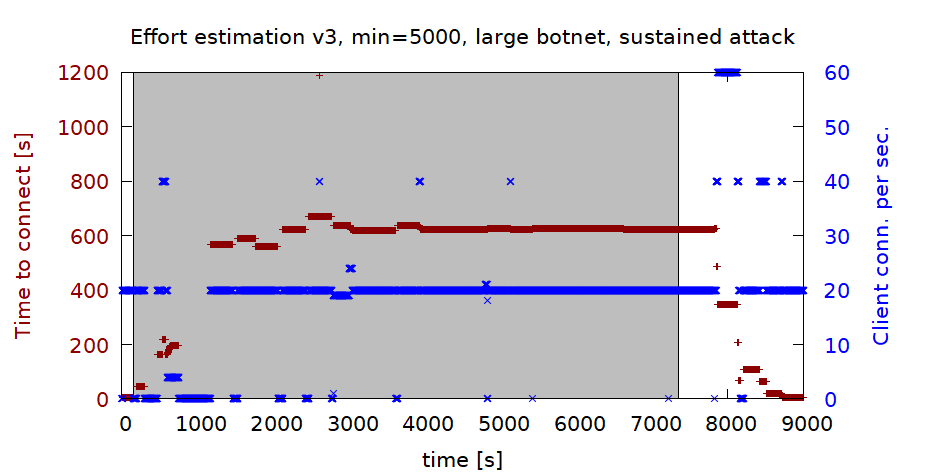

With the "small botnet" sustained attack, TCC stays at a constant value of 5 seconds:

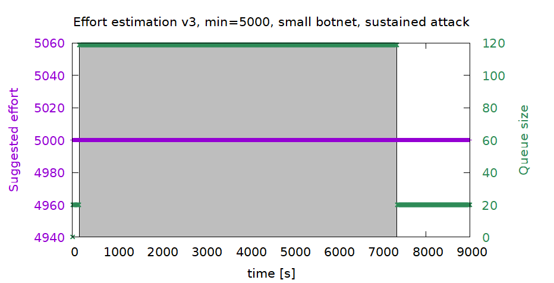

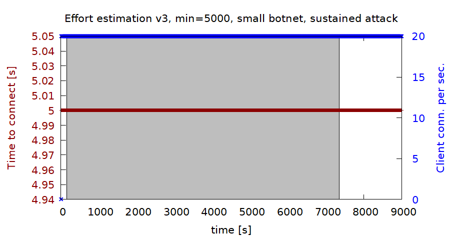

This should be considered a "feature" of this effort estimation algorithm. The suggested effort cannot drop to 0 because then it would be impossible to determine the total computing power of connecting clients. We can somewhat mitigate this by decreasing `MIN_EFFORT` from 5000 to 1000:

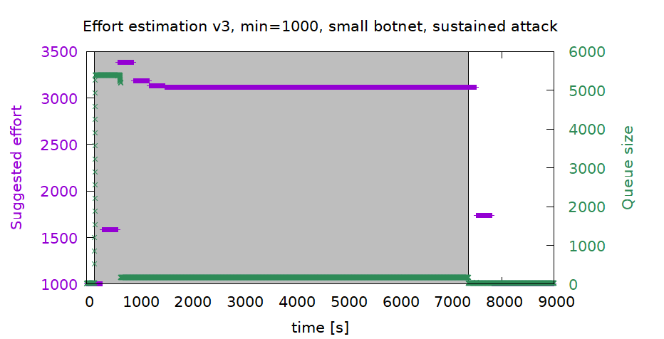

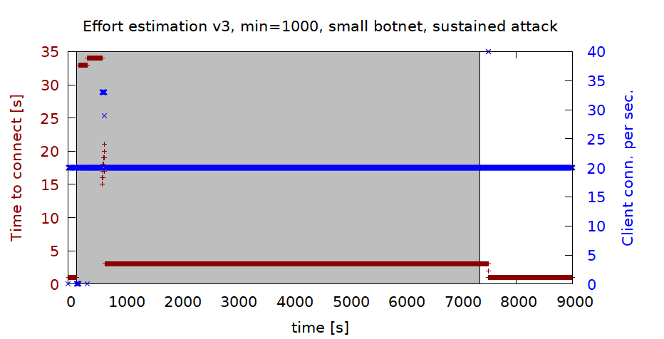

This improves TTC during the attack to slightly over 3 seconds. TTC of 1 second when there is no attack should be acceptable for most clients.

This algorithm also works well against precomputed attacks:

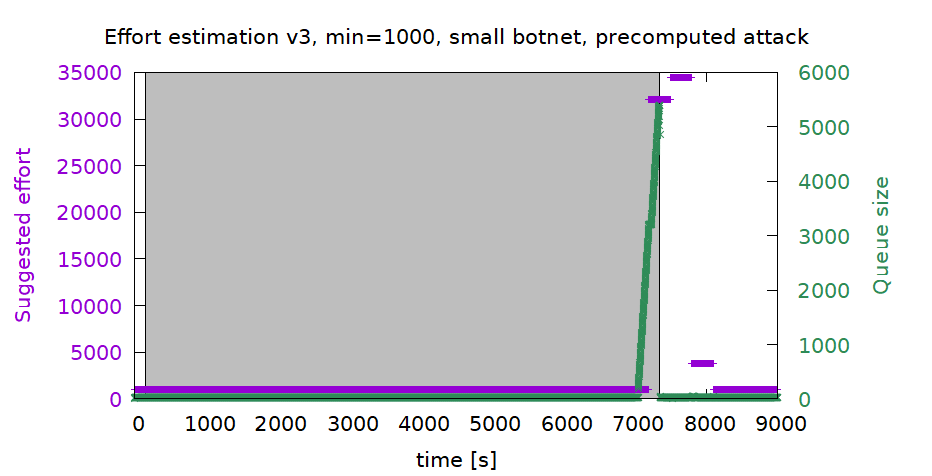

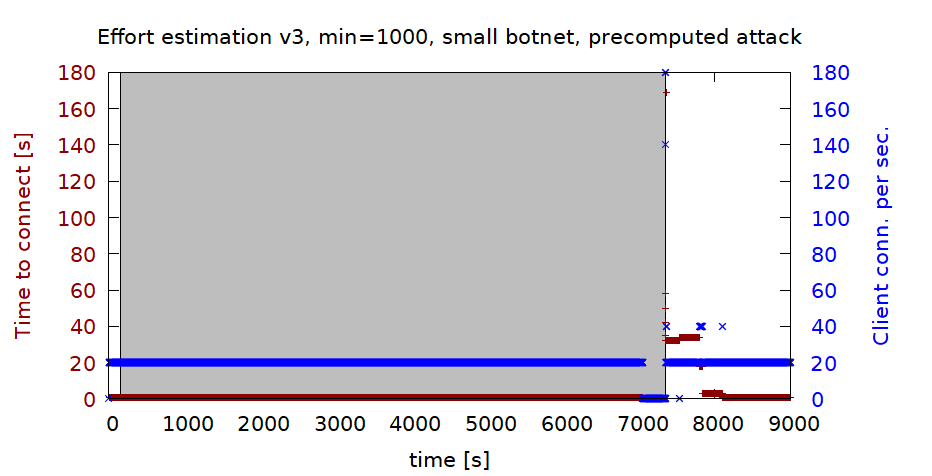

A 2-hour precomputed attack causes the TTC to temporarily increase for about 10 minutes.

## Conclusion

We suggest to use the following effort estimation algorithm with `MIN_EFFORT = 1000`:

```python
def recommend_effort3():
    effort = sum(trimmed_list)
    effort += sum(x.effort for x in handled)
    effort += sum(x.effort for x in queue)
    effort /= SVC_BOTTOM_CAPACITY * HS_UPDATE_PERIOD
    if effort < MIN_EFFORT:
        effort = MIN_EFFORT
    return effort
```

The simulations also show that PoW-protected services are resilient to bottom-half attacks regardless of the attacker's computing power.
